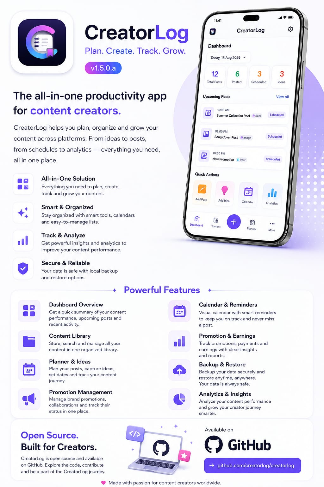
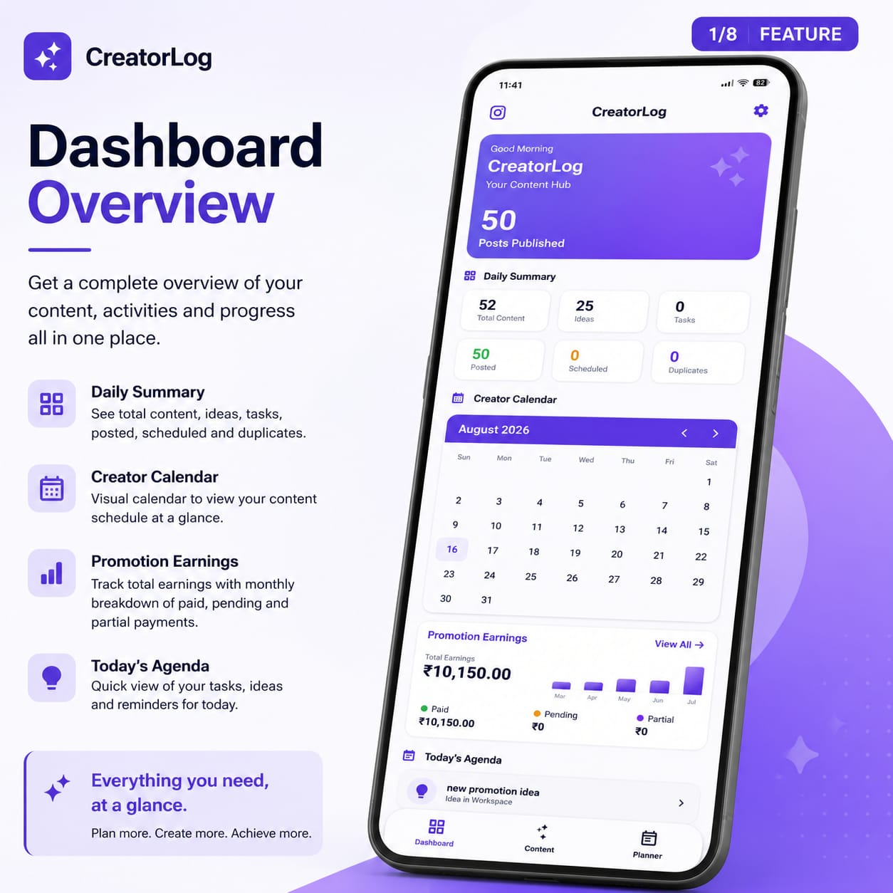
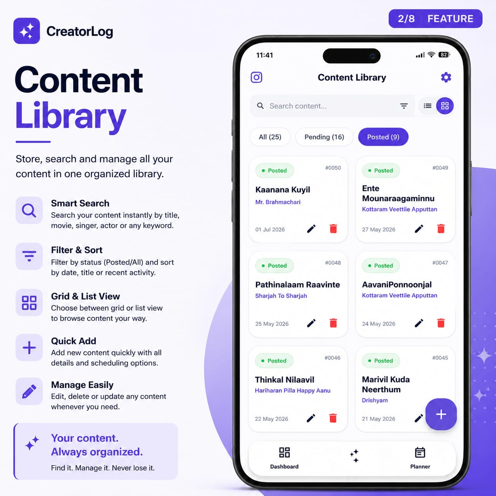
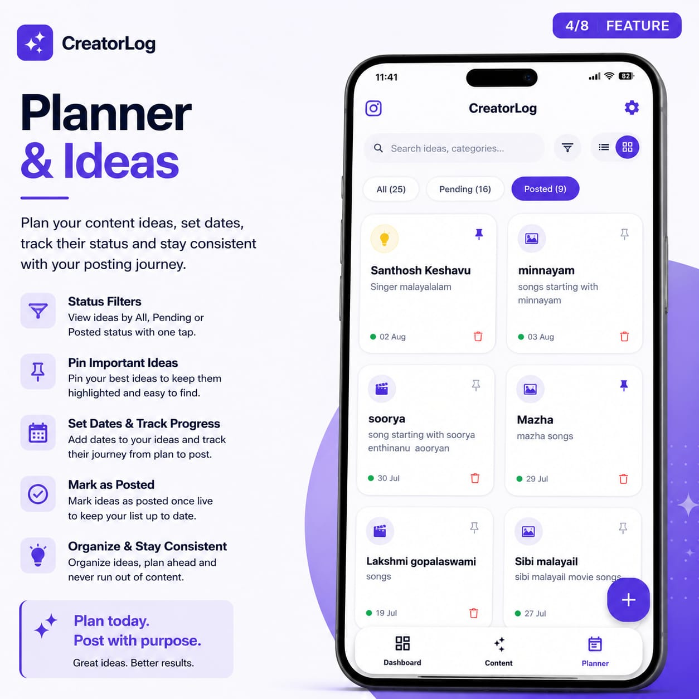
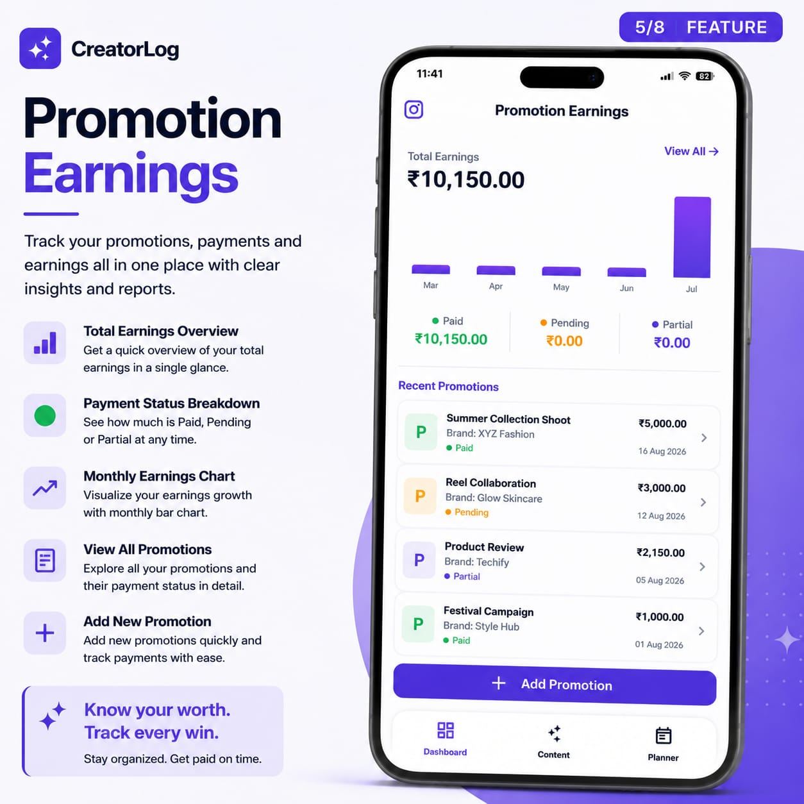
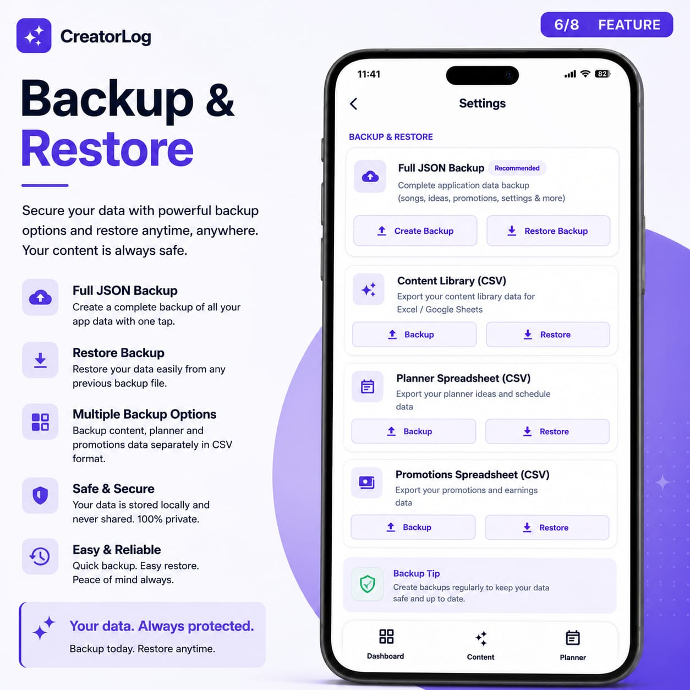
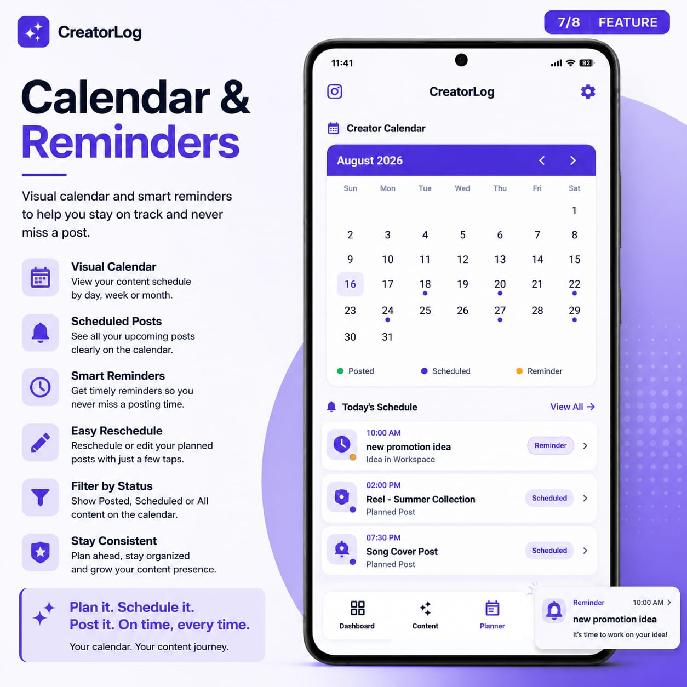

# CreatorLog — Content Tracker

An Android app built to help an Instagram music page (Voice Of Melody) track its posting history, content ideas, and paid promotions in one place — no more scrolling back through the feed to remember what's already been posted.

## Features

- **Dashboard** — quick overview of posting activity and promotion earnings
- **Creator Calendar** — see posts and reminders laid out by date
- **Songs Tracker** — log every song post: title, movie, singers, music director, language, content link, and notes
- **Idea Vault** — capture content ideas before they turn into posts, with posted-status tracking
- **Promotions Tracker** — track paid promotions/sponsorships: client, amount, payment status, payment date, and monthly earnings insights
- **Reminders** — schedule notifications for upcoming posts
- **Backup & Restore** — export/import data as JSON or CSV via clipboard, so nothing is lost if the app is reinstalled
- **Light / Dark / System theme** support

## Tech Stack

- Kotlin
- Jetpack Compose
- Room (local SQLite database)
- Material 3

## What's New

**v1.5.0**
- Redesigned the bottom navigation bar into a floating, notched-pill style bar with an animated elevated icon that travels between tabs
- Promotion amount is now optional for Pending/Partially Paid entries, and only required once a promotion is marked Paid
- General UI polish across Settings and shared components (button sizing, spacing, borders)
- Fixed content on Dashboard, Songs, Idea Vault, Promotions, Calendar, Backup & Restore, and Settings being partially hidden behind the new floating navigation bar
- Updated to target the latest Android SDK (36)

**v1.4.0**
- Added Promotion Earnings Insights — view detailed financial performance directly from the Dashboard
- Monthly earnings now reflect actual payments received, based on a new payment date field (instead of when the promotion was created)
- Faster cold-start experience
- Smoother navigation transitions between Dashboard, Content, and Planner tabs
- Scroll positions and search/filter states are now preserved when switching between sections
- Improved navigation bar icon alignment and rendering
- Fixed a bug where pending/unpaid promotions were incorrectly counted toward monthly earnings
- Fixed a Dashboard loading flicker on startup
- Fixed a remaining navigation bar animation hitch
- Removed leftover internal debug/performance logging
- Fixed a bug where restoring a JSON backup would reset all Idea Vault entries' posted-status to "not posted"

**v1.3.0**
- Added a Creator Calendar view to see posts and reminders laid out by date
- Added Reminders with notifications — schedule reminders for upcoming posts, with support for exact-time alerts and automatic rescheduling after a phone restart
- Added a content link field to song entries, so a post's Instagram link can be saved and opened directly from the app
- "Movie / Song" field is no longer required when adding a song, for quicker entry
- Tabs (Dashboard, Songs, Planner) now keep their scroll position and filters when switching between them or rotating the screen
- Optimized dashboard statistics calculation for better performance with larger libraries
- Fixed a bug where the Dashboard could get stuck on a loading animation indefinitely on a brand-new install with no data yet
- Fixed monthly repeat reminders not firing correctly when set on the 29th–31st, in shorter months
- Notifications now show the app's icon instead of a generic system icon

**v1.2.0**
- Added music director and language fields to song entries
- Added posted-status tracking to Idea Vault entries
- Fixed a crash that could occur when importing a malformed backup file (CSV/JSON)
- Updated app icon

**v1.0**
- Initial release — song post tracker, idea vault, backup/restore, theming

## How this was built

This app was built using [Google AI Studio](https://ai.studio) and Android Studio, with AI agent assistance handling most of the implementation (a "vibe-coded" project). It was built for a real use case — helping a family member manage content for their Instagram page — and then reviewed and hardened afterward (removing an unnecessary PIN lock feature, checking for security issues, and cleaning up the build for public release).

Being upfront about this: it's a practical, functional app rather than a from-scratch deep-dive into Android architecture, and it's shared here as an honest example of a real AI-assisted build.

## Run Locally

**Prerequisites:** [Android Studio](https://developer.android.com/studio)

1. Open Android Studio
2. Select **Open** and choose the directory containing this project
3. Allow Android Studio to fix any incompatibilities as it imports the project
4. Create a file named `.env` in the project directory and set `GEMINI_API_KEY` in that file to your Gemini API key (see `.env.example` for reference)
5. Run the app on an emulator or physical device

## Screenshots

  

### Dashboard Overview
Get a complete overview of your content, activities, and progress all in one place — daily summary, creator calendar, promotion earnings, and today's agenda at a glance.

  

### Content Library
Store, search, and manage all your posted content in one organized library — filter by status, sort by date or title, and edit or delete entries whenever you need.

  

### Planner & Ideas
Plan your content ideas, set dates, track their status, and stay consistent with your posting journey — pin your best ideas and mark them as posted once live.

  

### Promotion Earnings
Track your promotions, payments, and earnings all in one place — total earnings overview, payment status breakdown (Paid/Pending/Partial), and a monthly earnings chart.

  

### Backup & Restore
Secure your data with powerful backup options and restore anytime, anywhere — full JSON backup, or separate CSV exports for your content, planner, and promotions data.

  

### Calendar & Reminders
A visual calendar and smart reminders to help you stay on track and never miss a post — view by status, reschedule with a few taps, and get timely notifications.

  

